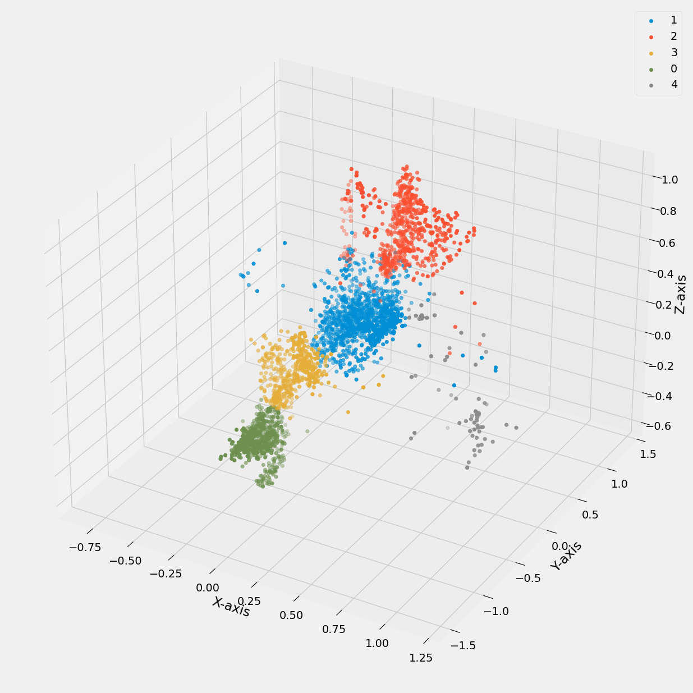
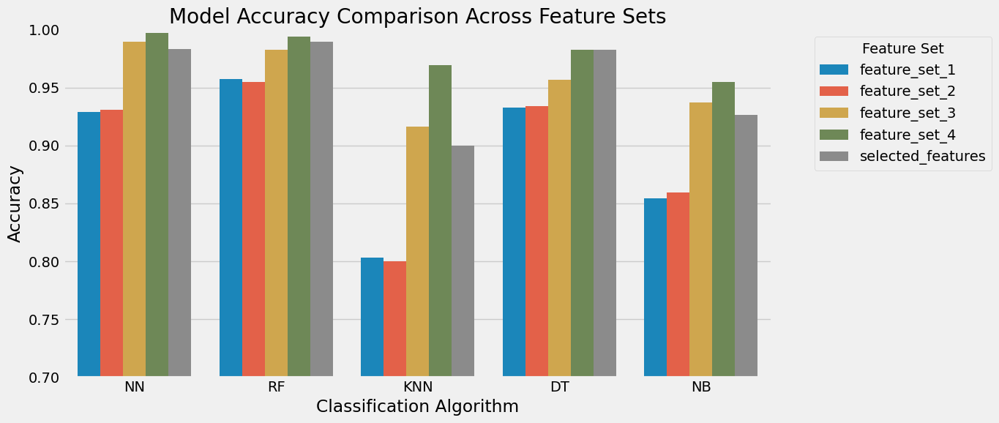
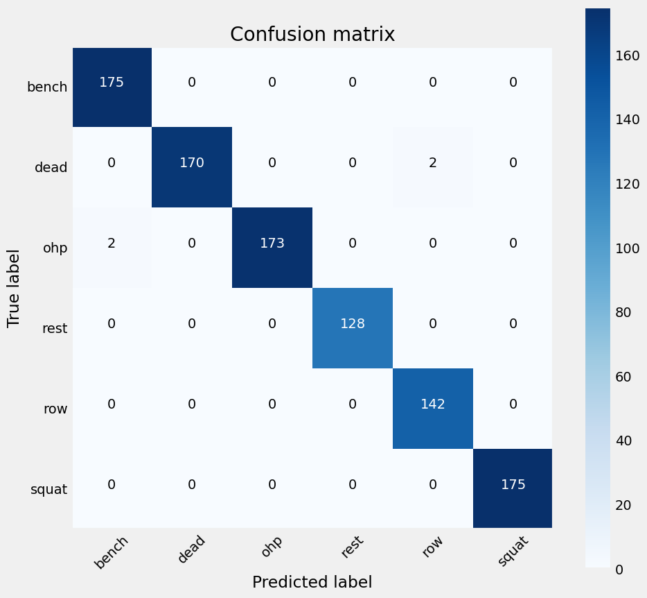

# FitnessActivity-Recognition-ML
# FitSense-ML

[](https://opensource.org/licenses/MIT)
[](https://www.python.org/downloads/)
[](https://scikit-learn.org/)
[](https://pandas.pydata.org/)

A machine learning system for exercise recognition and form analysis using sensor data from fitness trackers.

## Overview

FitSense-ML processes and analyzes motion data (accelerometer and gyroscope readings) from wearable fitness trackers to automatically identify exercise types, count repetitions, and evaluate form. This project demonstrates a complete machine learning pipeline for sensor-based human activity recognition specific to fitness activities.


## Features

- **Data Processing Pipeline**: Cleans, transforms, and structures raw sensor data for machine learning
- **Outlier Detection**: Implements multiple methods (IQR, Chauvenet's criterion, Local Outlier Factor)
- **Feature Engineering**: Extracts temporal features, frequency domain features, and PCA components
- **Exercise Classification**: Identifies different exercises (squats, bench press, deadlifts, etc.)
- **Visualization Tools**: Analyzes motion patterns across users and exercise intensities

## Project Structure

```
├── data/
│   ├── raw/             # Raw MetaMotion sensor data
│   └── interim/         # Processed datasets at various stages
├── reports/
│   └── figures/         # Generated visualizations
├── src/
│   ├── make_dataset.py  # Data loading and processing
│   ├── remove_outliers.py # Outlier detection and removal
│   ├── build_features.py # Feature engineering
│   ├── train_model.py   # Model training and evaluation
│   ├── visualize.py     # Visualization functions
│   ├── DataTransformation.py # Filtering and PCA
│   ├── TemporalAbstraction.py # Time-series feature extraction
│   ├── FrequencyAbstraction.py # FFT and frequency domain features
│   └── LearningAlgorithms.py # Classification algorithms
└── README.md
```

## Data Processing

The pipeline handles sensor data through several stages:

1. **Data Loading**: Parsing raw CSV files from MetaMotion sensors
2. **Preprocessing**: Resampling, merging, and synchronization of accelerometer and gyroscope data
3. **Outlier Removal**: Statistical methods to clean sensor data
4. **Feature Engineering**: Extraction of meaningful features from raw motion data



## Feature Engineering

The system extracts several types of features:

- **Basic Features**: Raw accelerometer and gyroscope readings
- **Statistical Features**: Means, standard deviations, and other statistical measures
- **Frequency Domain Features**: Fourier transformations to capture periodic patterns
- **Principal Components**: Dimensionality reduction while preserving signal variance
- **Derived Features**: Resultant acceleration, angular velocity, etc.



## Exercise Classification Results

The model can distinguish between various exercises including:
- Squats
- Bench Press
- Deadlifts
- Overhead Press
- (Other exercises in the dataset)

Performance varies by exercise type and intensity:



## Installation

```bash
# Clone the repository
git clone https://github.com/yourusername/FitSense-ML.git
cd FitSense-ML

# Create and activate a virtual environment
python -m venv venv
source venv/bin/activate  # On Windows: venv\Scripts\activate

# Install dependencies
pip install -r requirements.txt
```

## Usage

### Data Processing

```bash
# Process raw data files
python src/make_dataset.py

# Remove outliers
python src/remove_outliers.py

# Generate features
python src/build_features.py
```

### Model Training

```bash
# Train and evaluate models
python src/train_model.py
```

### Visualization

```bash
# Generate visualizations
python src/visualize.py
```

## Future Work

- Integration with real-time data streams
- Mobile application for immediate feedback
- Fine-tuning models for personalization
- Expanding to more exercise types
- Form quality assessment and correction suggestions

## Contributing

Contributions are welcome! Please feel free to submit a Pull Request.

1. Fork the repository
2. Create your feature branch (`git checkout -b feature/amazing-feature`)
3. Commit your changes (`git commit -m 'Add some amazing feature'`)
4. Push to the branch (`git push origin feature/amazing-feature`)
5. Open a Pull Request

## License

This project is licensed under the MIT License - see the LICENSE file for details.

## Acknowledgments

- MetaMotion for the sensor hardware
- All participants who contributed training data
- The scikit-learn and pandas communities
